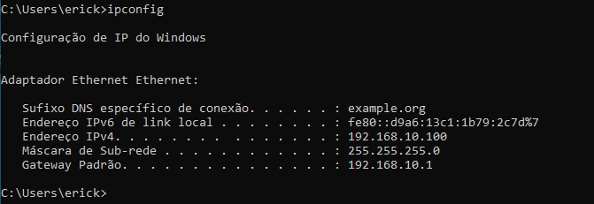
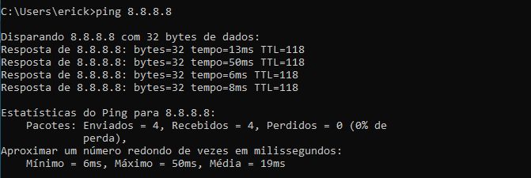

# infraestrutura-corporativa-linux
Projeto prático de construção de uma infraestrutura corporativa do zero utilizando Debian 12 (Roteamento, Firewall, DHCP, DNS e AD)

# 🏢 Infraestrutura Corporativa Zero-Cost com Debian 12

## 📌 Sobre o Projeto
Projeto prático focado na construção de uma infraestrutura de rede corporativa completa utilizando ferramentas Open Source. O objetivo é simular o ambiente "Core" de uma pequena/média empresa, provendo roteamento, segurança, distribuição de IPs e resolução de nomes totalmente baseados em Linux.

## 🚀 Fase 1: Core Network (Concluída)
Nesta primeira fase, o servidor Debian foi configurado para atuar como o coração da rede, assumindo as funções de Roteador de Borda, Firewall e Servidor de Serviços Essenciais para os clientes (Windows/Linux) da rede interna.

### Tecnologias e Serviços:
* **Roteamento e NAT:** `nftables` (Mascaramento de rede)
* **Servidor DHCP:** `isc-dhcp-server` (Distribuição automatizada de escopo IP)
* **Servidor DNS:** `bind9` / `named` (Resolução de nomes e Forwarder)

### 📸 Evidências e Validação

**1. Cliente recebendo IP corporativo (DHCP)**
*(Nota: Substitua o caminho abaixo pelo nome do seu print do DHCP)*

**2. Navegação via Firewall/NAT (DNS e Roteamento)**
*(Nota: Substitua o caminho abaixo pelo nome do seu print do Ping no Google)*

---
*Status: Aguardando início da Fase 2 (Servidor de Arquivos e Domínio com Samba).*
